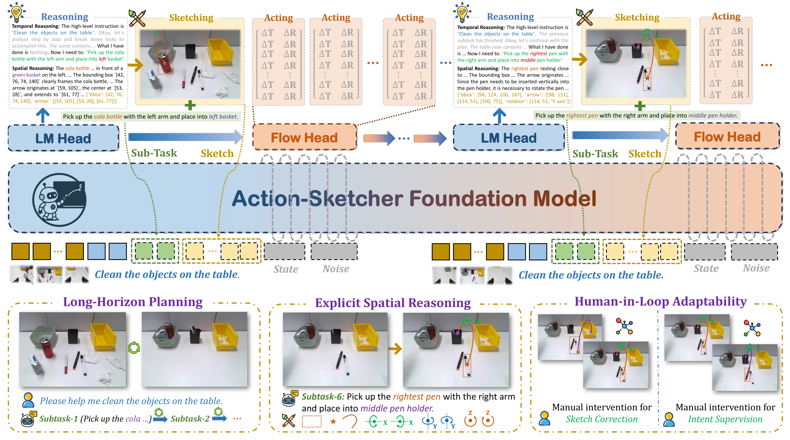
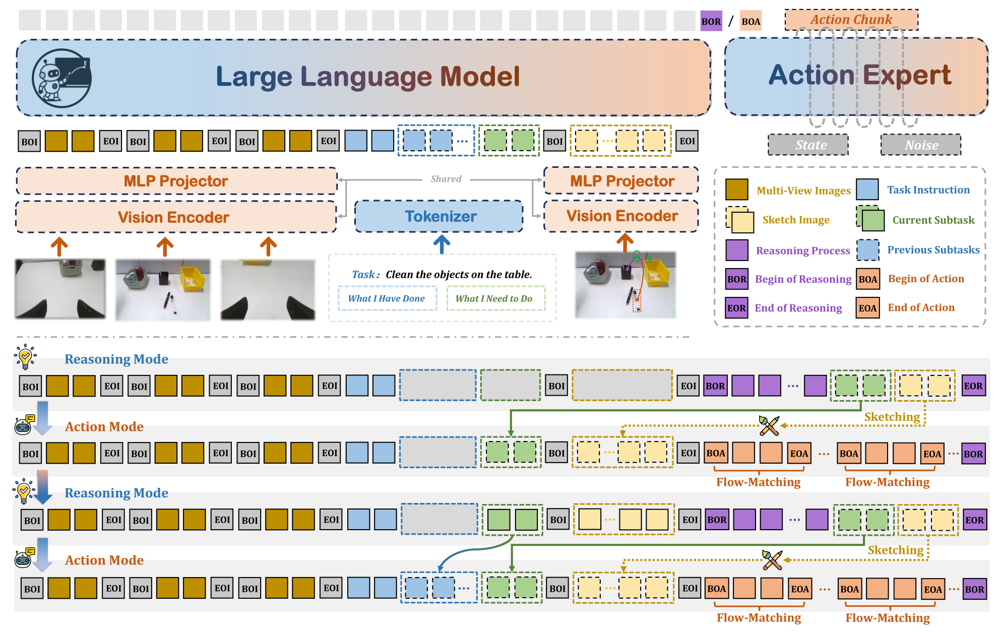
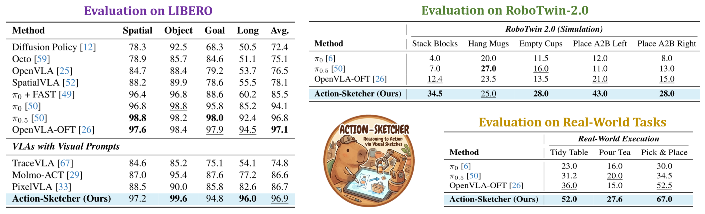

<h1 align="center">Action-Sketcher: From Reasoning to Action via Visual Sketches for Long-Horizon Robotic Manipulation</h1>

<h3 align="center">Make intent visible. Make action reliable.</h3>


<p align="center">
  <a href="https://arxiv.org/pdf/2601.01618"></a>
  &nbsp;
  <a href="https://action-sketcher.github.io/"></a>
  &nbsp;
  <a href="https://huggingface.co/datasets/petersonco/actionsketcher_libero"></a>
  &nbsp;
  <a href="https://huggingface.co/petersonco/action_sketcher-pi0-libero"></a>
</p>


## 🔥 Overview

**Action-Sketcher** operates in a ***See-Think-Sketch-Act*** loop, where a foundation model first performs temporal and spatial reasoning to decompose a high-level instruction (e.g., "Clean the objects on the table") into a subtask and a corresponding **Visual Sketch**. This sketch, composed of primitives like points, boxes, and arrows, serves as an explicit, human-readable plan that guides a low-level policy to generate robust action sequences. This methodology enables three key capabilities: ***(bottom left)*** long-horizon planning through task decomposition, ***(bottom middle)*** explicit spatial reasoning by grounding instructions in scene geometry, and ***(bottom right)*** seamless human-in-the-loop adaptability via direct sketch correction and intent supervision.

<div style="text-align: center; background-color: white;">
    
</div>


## 🗞️ News
- **`2026-02-22`**: 🔥🔥🔥 **Action-Sketcher** gets accepted to CVPR 2026! See you in Denver, Colorado, USA!
- **`2026-02-22`**: 🤗 We released [Action-Sketcher-PI0-LIBERO](https://huggingface.co/petersonco/action_sketcher-pi0-libero) model and inference codes.
- **`2026-01-05`**: 🔥 We released our [Project Page](https://action-sketcher.github.io/) of **Action-Sketcher**.


## 🎯 TODO
- [x] Release the model checkpoints and inference codes.
- [ ] Release the full dataset and training codes *(About 2 weeks)*.
- [ ] Release the dataset generation pipeline and GUI tools *(Maybe 1 month)*.


## 🤗 Model Zoo


| Models                   | Checkpoint                                                     | Description                                           |
|--------------------------|----------------------------------------------------------------|-------------------------------------------------------|
| PI0-LIBERO     | [🤗 petersonco/action_sketcher-pi0-libero](https://huggingface.co/petersonco/action_sketcher-pi0-libero)   | PI0 model fine-tuned on LIBERO benchmark      |
| PI0-RoboTwin   | 🤗 ***Coming soon ...***  | PI0 model fine-tuned on Specific RoboTwin Tasks      |
| PI0-RealWorld  | 🤗 ***Coming soon ...***  | PI0 model fine-tuned on Specific Real-World Tasks      |


## 🛠️ Setup

```bash
# clone repo
git clone https://github.com/FlagOpen/Action-Sketcher.git
cd Action-Sketcher

# build conda env
conda create -n action-sketcher python=3.10
conda activate action-sketcher
pip install -r requirements.txt

# download model weights from HuggingFace
huggingface-cli download petersonco/action_sketcher-pi0-libero --local-dir ./checkpoint
```

## 💡 Quick Inference

```bash
# Run LIBERO evaluation
python run_libero_example.py \
    --checkpoint ./checkpoint \
    --task_suite libero_goal \
    --num_episodes 50
```


## 🚀 Training

Action-Sketcher uses a 3-stage training pipeline:

### Data Preparation

Download the dataset from [🤗 petersonco/actionsketcher_libero](https://huggingface.co/datasets/petersonco/actionsketcher_libero):

```bash
huggingface-cli download petersonco/actionsketcher_libero --repo-type dataset --local-dir ./data/libero
```

The dataset includes:
- `dataset_index.json`: Index file containing paths to episode data
- `compiled_reasoning.json`: Visual reasoning annotations
- `action_stats.json`: Action normalization statistics

### Stage 2: Reasoning Training

Train the model to generate visual sketches (reasoning-only, no action prediction):

```bash
bash train_scripts/simulator/libero/run_stage_2.sh \
    --json_path /path/to/your/data/dataset_index.json \
    --data_root /path/to/your/data \
    --reasoning_json_path /path/to/your/data/compiled_reasoning.json \
    --normalization_path /path/to/your/data/action_stats.json \
    --pretrained_model_path ./ckpts/stage1_pretrained \
    --exp_name your_stage2_experiment
```

### Stage 3: Joint Action-Language Training

Train both reasoning and action prediction jointly:

```bash
bash train_scripts/simulator/libero/run_stage_3.sh \
    --json_path /path/to/your/data/dataset_index.json \
    --data_root /path/to/your/data \
    --reasoning_json_path /path/to/your/data/compiled_reasoning.json \
    --normalization_path /path/to/your/data/action_stats.json \
    --pretrained_model_path ./ckpts/stage2_checkpoint \
    --exp_name your_stage3_experiment
```

### Action-Only Fine-tuning (Optional)

Fine-tune on action prediction only (freezes reasoning):

```bash
bash train_scripts/simulator/libero/action_only.sh \
    --json_path /path/to/your/data/dataset_index.json \
    --data_root /path/to/your/data \
    --reasoning_json_path /path/to/your/data/compiled_reasoning.json \
    --normalization_path /path/to/your/data/action_stats.json \
    --pretrained_model_path ./ckpts/stage3_checkpoint \
    --exp_name your_action_only_experiment
```

### Checkpoint Conversion

Training saves checkpoints in DeepSpeed format. Convert to HuggingFace format for inference:

```bash
python scripts/convert_checkpoint.py \
    --input_path ./outputs/your_experiment/checkpoints/epoch=X-step=Y.ckpt \
    --output_path ./ckpts/hf_model
```


## 🤖 Method

The Action-Sketcher framework is **model-agnostic** and can be integrated with any VLA model with an event-driven loop that (i) summarizes the next subtask, (ii) emits a compact Visual Sketch (points, boxes, arrows, relations) that externalizes spatial intent, and (iii) synthesizes an action chunk conditioned on that sketch and the robot state. The explicit intermediate supports targeted supervision, on-the-fly correction, and reliable long-horizon execution within a single-model architecture.

<div align="center">
    
</div>

## ✨ Experiments
<div align="center">
    
</div>


## 📑 Citation

If you find our work helpful, feel free to cite it:
```
@article{tan2026action,
  title={Action-Sketcher: From Reasoning to Action via Visual Sketches for Long-Horizon Robotic Manipulation},
  author={Tan, Huajie and Co, Peterson and Xu, Yijie and Rong, Shanyu and Ji, Yuheng and Chi, Cheng and others},
  journal={arXiv preprint arXiv:2601.01618},
  year={2026}
}
```
